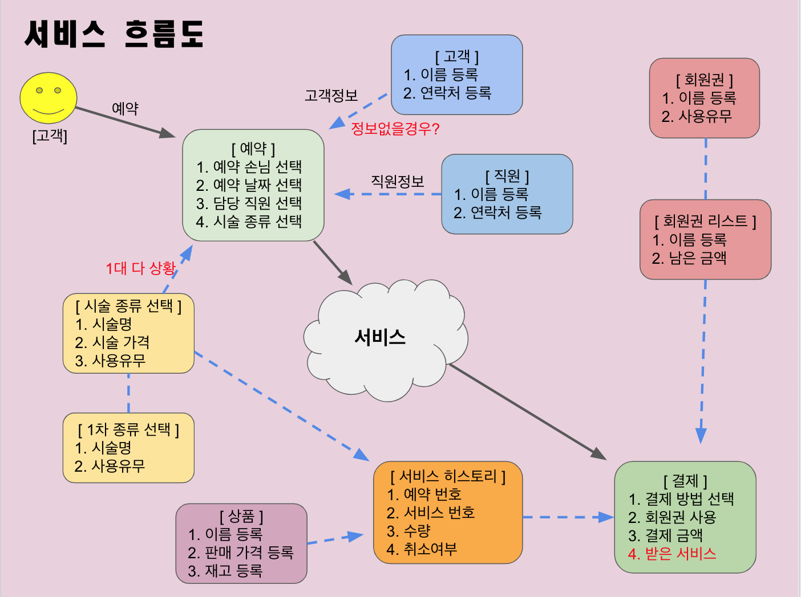
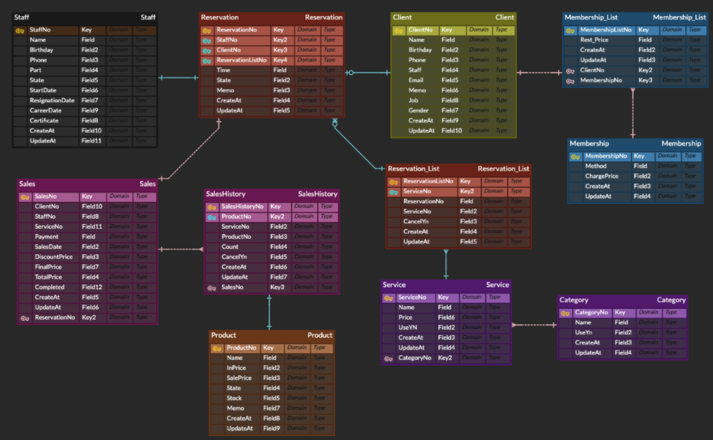

##### 🏷 여자친구를 위해 계획한 토이 프로젝트입니다. <br>🏷 우연히 이 코드를 보시는 분들 현실적인 피드백주시면 감사하겠습니다. <br>🏷 funchcode@gmail.com 👈🏽 피드백(url 또는 키워드)주시면 열심히 공부하겠습니다. <br>
<br>
<<<<<<< HEAD
<h2>네일 샵 관리 프로그램(미완)</h2>

=======
<h2>네일 샵 관리 프로그램(미완)</h2> <br>
Commit
>>>>>>> 866913443df0a20877f1e60678dae6e578e5b325
### 사용(할)기술

- SpringBoot(Gradle) + Handlebars + jQuery + Bootstrap
- MySQL
- Full Calendar

### 구현(할)기능

- 고객, 직원, 서비스(CRUD)
- Calendar 예약 관리
- 단축키 등록
- Kakao플러스 친구 알림받기
- Instagram Graph API로 알림받기(앱검수필요)
- Google chart로 매출표기
- 직원 월급 자동 계산
- 서비스 사용 제한

### 고민

- 아트에 대한 고민 해결방법
- 효과적인 광고기능
- 네일 샵 블로그 구현고민 + 챗봇 + 예약시스템
- 최신 유행 트랜드 어떤 주제와 방식으로 크롤링 고민

---
### 삽질로그 <br>

👉🏽 datasource의 url 값에 serverTimeZone=UTC를 작성해야 KST(Korea Standard Time) 오류를 해결할 수 있다. <br>
<br>
👉🏽 ```@Builder``` 사용 시 cannot be applied to given types 에러가 발생<br>
@Builder 사용 시에 모든 필드를 가지는 생성자를 가지게 해주면 된다(@AllArgsConstructor).<br>
<br>
👉🏽 ```@GeneratedValue()```에서 strategy에서 GenerationType.AUTO를 사용 시에 hibernate_sequence테이블이 생성되고 next_val 칼럼에 다음 번호가 저장된다.<br>
GenerationType.AUTO를 사용하는 모든 Entity가 hibernate_sequence 테이블 sequence를 사용하게 된다.<br>
<br>
👉🏽 ```@GeneratedValue()```에서 strategy를 GenerationType.IDENTITY를 사용 시에 default value 오류가 발생했다.<br>
이는 MySQL 해당 Entity 키 칼럼에 대한 Auto_increment 옵션을 설정하지 않아서 발생한 오류였다.<br>
<br>
👉🏽 ```@Builder```을 사용시에 필수로 받아야하는 인자를 설정할 수 없다. <br>
<br>
👉🏽 ```@Builder```시에 @Builder.Default를 설정하지 않으면 0, null, false 값이 나온다.<br>
<br>
👉🏽 서버를 Auto 재가동하는 방법은 Gradle에 spring-boot-devtools를 추가해주고 [command+shift+a], registry에 compiler.automake.allow.when.app.running에 체크를 해준다.<br>
또한 application.yml에 spring:devtools:livereload:enabled: true를 설정해준다.<br>
<br>
👉🏽 Handlebars 정적자원 변경시 자동 갱신하는 방법은 application.yml에 handlebars:cache: false로 설정한다.<br>
<br>
👉🏽 Javascript Arrow Function에서 에러가 발생 시 Intellij IDEA Preferences에 Language 클릭 Javascript ECMA Script 6로 업그레이드하면 된다.<br>
<br>
👉🏽 버튼 Click시에 Ajax요청을 보내는 코드 중 Input 속성(required 등)이 무시 <br>
현재 jQuery로 이벤트 및 Ajax처리를 구현 중인데 Id 값을 Form태그에 주고 이벤트를 submit으로 연결하면 Input 속성 이용 가능하다. <br>
<br>
👉🏽 HTML Select에 만족하는 조건이 없을 경우 Input으로 데이터를 다루고 싶었다. <br>
`<input list="ok" /><datalist id="ok"> ...options... </datalist>`원하는 동작을 얻을 수 있었다. <br>
<br>
👉🏽 Ajax 요청 시 다음과 같은 코드 `...application/x-www-form-urlencoded; charset=UTF-8` ContentType을 넘기게 된다. <br>
Ajax 요청 시에 ContentType을 명시하지 않게 되면 default로 위의 텍스트가 설정된다. <br>
RequestBody로 JSON을 날릴 것이기 때문에 ContentType을 Ajax 코드 내에서 `application/json`으로 명시한다. <br>
강제로 ContentType을 `application/json`주면 내가 원하는 FormData가 아닌 Payload로 날라가기 때문에 다루기 어렵기만하다. <br>
request를 직접 핸들링하는 방식보다는 DTO를 만들고 request안에 json으로 넘어온 정보를 Jackson과 같은 라이브러리를 사용해서 DTO에 집어넣는 형식이 간편하다. <br> 
<br>
👉🏽 ContentType을 json으로 명시했지만 `HttpMessageNotReadableException...was expecting ('true', 'false' or 'null')` 에러가 발생한다. <br>
json 데이터 중 key로 인식되지 않아 발생하는 문제로서, `JSON.stringify()`를 통해 key로 인식되기 위해 key도 문자열로 만들어서 보내야한다. <br> 
<br>

---
### 계획(진행) 현황 <br>

**서비스 흐름도** <br>
 <br>
<br>
**ERD** <br>

